<!-- 
╔══════════════════════════════════════════════════════════════════════════════╗
║                                                                              ║
║   ██╗  ██╗ █████╗ ███╗   ███╗███████╗ █████╗                                 ║
║   ██║  ██║██╔══██╗████╗ ████║╚══███╔╝██╔══██╗                                ║
║   ███████║███████║██╔████╔██║  ███╔╝ ███████║                                ║
║   ██╔══██║██╔══██║██║╚██╔╝██║ ███╔╝  ██╔══██║                                ║
║   ██║  ██║██║  ██║██║ ╚═╝ ██║███████╗██║  ██║                                ║
║   ╚═╝  ╚═╝╚═╝  ╚═╝╚═╝     ╚═╝╚══════╝╚═╝  ╚═╝                                ║
║                                                                              ║
║            🚀 DATA & AI ENGINEER • ML SPECIALIST • LLM AGENT BUILDER 🚀     ║
║                                                                              ║
╚══════════════════════════════════════════════════════════════════════════════╝
-->

<div align="center">
  
  <!-- ═══════════════════════════════════════════════════════════════════════════ -->
  <!-- 🎯 ANIMATED HEADER                                                          -->
  <!-- ═══════════════════════════════════════════════════════════════════════════ -->
  
  
  
  <br/>
  
  <!-- ═══════════════════════════════════════════════════════════════════════════ -->
  <!-- 📊 PROFILE BADGES                                                           -->
  <!-- ═══════════════════════════════════════════════════════════════════════════ -->
  
  <a href="https://github.com/hamza-prof">
    
  </a>
  &nbsp;
  <a href="https://github.com/hamza-prof?tab=repositories">
    
  </a>
  &nbsp;
  <a href="https://github.com/hamza-prof?tab=followers">
    
  </a>
  &nbsp;
  <a href="https://github.com/hamza-prof">
    
  </a>
  
</div>

<br/>

<!-- ═══════════════════════════════════════════════════════════════════════════ -->
<!-- 🖥️ TERMINAL INTRO SECTION                                                   -->
<!-- ═══════════════════════════════════════════════════════════════════════════ -->

<div align="center">
  
</div>

<br/>


<br/>

<!-- ═══════════════════════════════════════════════════════════════════════════ -->
<!-- 👤 ABOUT ME SECTION                                                          -->
<!-- ═══════════════════════════════════════════════════════════════════════════ -->


<br/><br/>

<table>
<tr>
<td width="55%" valign="top">

### 🎯 What I Do

```yaml
name: Muhammad Hamza
located_in: Pakistan 🇵🇰
current_status: Data & AI Engineer at Autonomous
education: BS Computer Science – IBA Sukkur University

areas_of_expertise:
  - 🤖 LLM Agents & Generative AI
  - 📊 Data Engineering & ETL Pipelines
  - 🧠 Machine Learning & Deep Learning
  - 🔬 Causal Inference & Marketing Analytics
  - 📱 Mobile Development (Flutter)
  - 🗣️ Voice AI & Conversational Systems

currently_building:
  - Production LLM Agent Workflows
  - Causal Inference for Marketing ROI
  - RAG-powered AI Systems

life_philosophy: "Code is poetry. AI is the canvas."
```

</td>
<td width="45%" valign="top">

### 🚀 Current Focus

- 🔬 **Researching** Bayesian Causal Inference (BSTS)
- 🤖 **Building** LLM Agents with LangChain & LangGraph
- 🧠 **Deploying** RAG systems for production
- 🎯 **Optimizing** ML models for clinical AI
- 📊 **Engineering** end-to-end ETL pipelines
- 🗣️ **Developing** Voice AI with Bland AI

<br/>

### 💡 Quick Facts

- 🎓 BSCS from IBA Sukkur University (2021-2025)
- 🔥 Boosted ML accuracy from 79% → 92%
- 🏆 98% ROC-AUC on fraud detection
- ☕ Fueled by coffee & curiosity

</td>
</tr>
</table>

<br/>


<br/>

<!-- ═══════════════════════════════════════════════════════════════════════════ -->
<!-- 💼 EXPERIENCE SECTION                                                        -->
<!-- ═══════════════════════════════════════════════════════════════════════════ -->

<div align="center">

### 💼 Professional Experience

<br/>

<table>
<tr>
<td align="center" width="33%">
  <br/>
  <sub><b>Oct 2025 – Present</b></sub><br/>
  <sub>ETL Pipelines • LLM Agents • Voice AI • Causal Inference</sub>
</td>
<td align="center" width="33%">
  <br/>
  <sub><b>Mar 2025 – Oct 2025</b></sub><br/>
  <sub>GenAI Automation • RAG • Model Validation • Mobile Dev</sub>
</td>
<td align="center" width="33%">
  <br/>
  <sub><b>Jun 2024 – Aug 2024</b></sub><br/>
  <sub>Churn Prediction • TensorFlow • Feature Engineering</sub>
</td>
</tr>
<tr>
<td align="center" width="33%">
  <br/>
  <sub><b>Jul 2024 – Dec 2024</b></sub><br/>
  <sub>RLHF • Gemini Model Training • QA</sub>
</td>
<td align="center" width="33%">
  <br/>
  <sub><b>Feb 2023 – Jan 2024</b></sub><br/>
  <sub>RLHF • OpenAI & Dolphin Models • DSA & ML</sub>
</td>
<td align="center" width="33%">
</td>
</tr>
</table>

</div>

<br/>


<br/>

<!-- ═══════════════════════════════════════════════════════════════════════════ -->
<!-- 🏆 ACHIEVEMENTS SECTION                                                     -->
<!-- ═══════════════════════════════════════════════════════════════════════════ -->


<br/><br/>

<div align="center">
  
  <!-- GitHub Trophies -->
  <a href="https://github.com/ryo-ma/github-profile-trophy">
    
  </a>
  
</div>

<br/>


<br/>

<!-- ═══════════════════════════════════════════════════════════════════════════ -->
<!-- 🔬 FEATURED PROJECTS                                                        -->
<!-- ═══════════════════════════════════════════════════════════════════════════ -->

<div align="center">

### 🔬 Featured Projects & Research

<br/>

<table>
<tr>
<td width="50%" valign="top">

#### 🎯 Real-Time ATM Weapon Detection (FYP)
> YOLOv8 • React.js • Express.js • MongoDB

- 🔫 Real-time CCTV weapon detection (guns, knives) — **92% accuracy**
- 📹 Live video streaming with alert mechanisms
- 🌐 Full-stack app with React frontend & Express backend

</td>
<td width="50%" valign="top">

#### 💳 IEEE-CIS Transaction Fraud Detection
> LightGBM • Feature Engineering • Cross-Validation

- 🏆 **98% ROC-AUC** score on financial fraud detection
- 📊 Advanced class imbalance handling & feature engineering
- ⚙️ Hyperparameter-tuned for production reliability

</td>
</tr>
<tr>
<td width="50%" valign="top">

#### 📊 YouTube Sentiment Analysis (Real-Time)
> NLP • YouTube API • React.js • Matplotlib

- 🔄 Real-time YouTube comment sentiment pipeline
- 🧠 NLP classifier for audience reaction categorization
- 📈 Trend visualizations with Matplotlib dashboards

</td>
<td width="50%" valign="top">

#### 🏥 Diabetes Detection System
> XGBoost • Clinical AI • Probability Framework

- 🤖 Risk prediction with XGBoost classifier
- 📋 Probability-based classification: Diabetic / Pre-diabetic / Non-diabetic
- 🔬 Interpretable results for clinical decision support

</td>
</tr>
</table>

</div>

<br/>


<br/>

<!-- ═══════════════════════════════════════════════════════════════════════════ -->
<!-- 📊 GITHUB ANALYTICS                                                         -->
<!-- ═══════════════════════════════════════════════════════════════════════════ -->


<br/><br/>

<div align="center">
  
  <!-- GitHub Stats + Custom Streak in ONE ROW -->
  <a href="https://github.com/hamza-prof">
    
  </a>
  &nbsp;
  <a href="https://github.com/hamza-prof">
    
  </a>
  
  <br/><br/>
  
  <!-- 📊 REAL-TIME LANGUAGE USAGE WITH PROGRESS BARS -->
  <a href="https://github.com/hamza-prof">
    
  </a>
  
  <br/><br/>
  
  <!-- Activity Graph -->
  <a href="https://github.com/hamza-prof">
    
  </a>
  
  <br/><br/>
  
  <!-- Additional Stats Cards -->
  
  
</div>

<br/>


<br/>

<!-- ═══════════════════════════════════════════════════════════════════════════ -->
<!-- 🎮 CONTRIBUTION SHOWCASE                                                    -->
<!-- ═══════════════════════════════════════════════════════════════════════════ -->


<br/><br/>

<div align="center">
  
  <!-- Pac-Man Contribution Graph -->
  <picture>
    <source media="(prefers-color-scheme: dark)" srcset="./assets/pacman-contribution-graph-dark.svg"/>
    <source media="(prefers-color-scheme: light)" srcset="./assets/pacman-contribution-graph.svg"/>
    
  </picture>
  
  <br/>
  
  <sub>👾 Watch Pac-Man devour my contributions!</sub>
  
</div>

<br/>


<br/>

<!-- ═══════════════════════════════════════════════════════════════════════════ -->
<!-- ⚡ TECH STACK                                                               -->
<!-- ═══════════════════════════════════════════════════════════════════════════ -->


<br/><br/>

<div align="center">

<!-- 💻 LANGUAGES -->
<h4>💻 Languages</h4>
<p>
  <a href="https://www.python.org/" target="_blank"></a>
  <a href="https://dart.dev/" target="_blank"></a>
  <a href="https://www.mysql.com/" target="_blank"></a>
  <a href="https://developer.mozilla.org/en-US/docs/Web/JavaScript" target="_blank"></a>
  <a href="https://www.gnu.org/software/bash/" target="_blank"></a>
</p>

<!-- 🤖 AI & MACHINE LEARNING -->
<h4>🤖 AI & Machine Learning</h4>
<p>
  <a href="https://www.tensorflow.org/" target="_blank"></a>
  <a href="https://pytorch.org/" target="_blank"></a>
  <a href="https://scikit-learn.org/" target="_blank"></a>
  <a href="https://opencv.org/" target="_blank"></a>
</p>
<p>
  
  
  
  
  
  
  
  
</p>

<!-- 🌐 FRAMEWORKS -->
<h4>🌐 Frameworks</h4>
<p>
  <a href="https://flask.palletsprojects.com/" target="_blank"></a>
  <a href="https://www.djangoproject.com/" target="_blank"></a>
  <a href="https://flutter.dev/" target="_blank"></a>
  <a href="https://reactjs.org/" target="_blank"></a>
</p>

<!-- 🗄️ DATABASES -->
<h4>🗄️ Databases</h4>
<p>
  <a href="https://www.mongodb.com/" target="_blank"></a>
  <a href="https://www.postgresql.org/" target="_blank"></a>
  <a href="https://www.mysql.com/" target="_blank"></a>
</p>

<!-- 🔧 TOOLS & PLATFORMS -->
<h4>🔧 Tools & Platforms</h4>
<p>
  <a href="https://git-scm.com/" target="_blank"></a>
  <a href="https://www.docker.com/" target="_blank"></a>
  <a href="https://aws.amazon.com/" target="_blank"></a>
  <a href="https://www.linux.org/" target="_blank"></a>
  <a href="https://code.visualstudio.com/" target="_blank"></a>
  <a href="https://www.postman.com/" target="_blank"></a>
</p>
<p>
  
  
  
  
</p>

<!-- 🧪 SPECIALIZATIONS -->
<h4>🧪 Specializations</h4>
<p>
  
  
  
  
  
  
</p>

</div>

<br/>


<br/>

<!-- ═══════════════════════════════════════════════════════════════════════════ -->
<!-- 🔥 CURRENTLY WORKING ON                                                     -->
<!-- ═══════════════════════════════════════════════════════════════════════════ -->

<div align="center">
  
### ⚡ Currently Building & Learning

<br/>

<a href="https://github.com/hamza-prof">
  
</a>
&nbsp;
<a href="https://github.com/hamza-prof">
  
</a>
&nbsp;
<a href="https://github.com/hamza-prof">
  
</a>

</div>

<br/>


<br/>

<!-- ═══════════════════════════════════════════════════════════════════════════ -->
<!-- 🎓 EDUCATION & CERTIFICATIONS                                               -->
<!-- ═══════════════════════════════════════════════════════════════════════════ -->

<div align="center">

### 🎓 Education & Certifications

<br/>

<table>
<tr>
<td align="center" width="33%">
  <br/>
  <sub><b>2021 – 2025</b></sub>
</td>
<td align="center" width="33%">
  <br/>
  <sub><b>Jun 2023 – Sep 2023</b></sub>
</td>
<td align="center" width="33%">
  <br/>
  <sub><b>Nov 2025 – Jan 2026</b></sub>
</td>
</tr>
</table>

</div>

<br/>


<br/>

<!-- ═══════════════════════════════════════════════════════════════════════════ -->
<!-- 🌐 CONNECT WITH ME                                                          -->
<!-- ═══════════════════════════════════════════════════════════════════════════ -->


<br/><br/>

<div align="center">
  
<a href="https://github.com/hamza-prof" target="_blank">
  
</a>
&nbsp;
<a href="https://linkedin.com/in/muhammad-hamza/" target="_blank">
  
</a>
&nbsp;
<a href="mailto:hhamza2937@gmail.com">
  
</a>
&nbsp;
<a href="tel:+923058769597">
  
</a>

</div>

<br/>


<br/>

<!-- ═══════════════════════════════════════════════════════════════════════════ -->
<!-- 💡 RANDOM DEV QUOTE                                                         -->
<!-- ═══════════════════════════════════════════════════════════════════════════ -->

<div align="center">
  
### 💭 Random Dev Quote

<br/>

<a href="https://github.com/hamza-prof">
  
</a>

</div>

<br/>

<!-- ═══════════════════════════════════════════════════════════════════════════ -->
<!-- 🌟 FOOTER                                                                   -->
<!-- ═══════════════════════════════════════════════════════════════════════════ -->

<div align="center">
  
  
  
  <br/><br/>
  
  
  
</div>

<!-- ═══════════════════════════════════════════════════════════════════════════ -->
<!-- 📝 END OF README                                                            -->
<!-- ═══════════════════════════════════════════════════════════════════════════ -->
