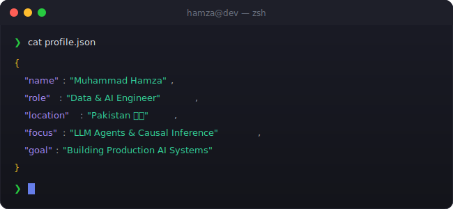

<div align="center">

# 👋 Hi, I'm Muhammad Hamza


<br>


</div>

<br>

<div align="center">
  
</div>

<br>

<div align="center">
  
</div>

<br>

<div align="center">
  <h2>
    🌟 <strong>Transforming Data into Intelligence | Building AI Systems that Scale</strong> 🌟
  </h2>
</div>

<br>

<div align="center">
  
</div>

<!-- ═══════════════════ WHAT I DO ═══════════════════════════ -->

##  What I Do

 

I'm a **Data & AI Engineer** who builds intelligent systems that solve real-world problems. My expertise spans:

```python
class DataAIEngineer:
    def __init__(self):
        self.name = "Muhammad Hamza"
        self.specializations = [
            "End-to-End ML Pipelines",
            "AI Agent Development",
            "RAG Systems Architecture",
            "Growth Analytics",
            "ML Model Optimization",
            "Full-Stack Development"
        ]
    
    def current_mission(self):
        return "Delivering production-ready AI solutions"
```

- 🔄 **End-to-End ML Pipelines** — From data ingestion to model deployment
- 🤖 **AI Agent Development** — LangChain, LangGraph, autonomous systems
- 🔍 **RAG Systems** — Building context-aware AI applications
- 📊 **Growth Analytics** — Data-driven decision making & experimentation
- 🎯 **ML Model Optimization** — Fine-tuning for production accuracy
- 📱 **Full-Stack Development** — React, Express, Flutter, and more

<br clear="both">

<div align="center">
  
</div>

<!-- ═══════════════════ PROFESSIONAL JOURNEY ═══════════════ -->

## 💼 Professional Journey

<table>
<tr>
<td width="50%" valign="top">

### 🌟 **Autonomous Data & AI Engineer**
**Oct 2025 - Present**

#### 🧪 **Data Scientist @ Sene**
```yaml
achievements:
  - Built end-to-end ETL pipelines for structured/unstructured data
  - Performed EDA and fine-tuned ML models to achieve target accuracy
  - Developed predictive analytics models for automated decision-making

tech_stack:
  - Python, Scikit-learn, Pandas
  - AWS (S3, Lambda, Redshift)
```

#### 📈 **Growth Data Scientist @ Memox.io**
```yaml
achievements:
  - Designed A/B tests and evaluated marketing performance
  - Implemented funnel tracking and conversion optimization
  - Built automated email agents using LangChain
  - Conducted prompt engineering for multiple clients

tech_stack:
  - Python, LangChain, PostHog
  - BigQuery, Looker Studio
```

</td>
<td width="50%" valign="top">

### 🔧 **AI/ML Engineer @ Sofstica**
**Mar 2025 - Oct 2025**

#### 🤖 **AI/ML Engineering**
```yaml
projects:
  - QA automation tool using Groq API + LangChain
  - Browser-execution agent with Playwright
  - RRS medical chatbot (RAG + LangChain)
  - Validation agent comparing AI models

tech_stack:
  - LangChain, LangGraph, RAG
  - Groq API, Playwright
```

#### 📱 **Flutter Development**
```yaml
projects:
  - Fixed UI/logic issues for Routica app
  - Built architecture for Guardian Angel
  - Enhanced C4Life Installer app
  - Delivered solutions using MVVM architecture

tech_stack:
  - Flutter, Dart, MVVM
  - Stacked, Google Maps API
```

</td>
</tr>
<tr>
<td width="50%" valign="top">

### 📊 **Intern Data Scientist @ Digitenic**
**Jun 2024 - Aug 2024**

```javascript
const experience = {
  role: "Data Science Intern",
  achievements: [
    "Built ML models using TensorFlow & Scikit-learn",
    "Performed data preprocessing & feature engineering",
    "Collaborated on real-world data science projects"
  ]
};
```

</td>
<td width="50%" valign="top">

### 🎯 **AI Trainer & Coder @ Scale AI**
**Feb 2023 - Jan 2024**

```javascript
const experience = {
  role: "AI Trainer & Coder",
  achievements: [
    "Labeled & reviewed data for Gemini model training",
    "Evaluated and refined LLM responses",
    "Solved complex DSA/ML tasks under tight deadlines",
    "Contributed to improving AI model performance"
  ]
};
```

</td>
</tr>
</table>

<div align="center">
  
</div>

<!-- ═══════════════════ FEATURED PROJECTS ═══════════════════ -->

## 🏆 Featured Projects

<table>
<tr>
<td width="50%" valign="top">

### 🔫 **Real-Time ATM Weapon Detection**
**Final Year Project — AI-Powered Security**


```python
project = {
    "problem": "ATM security threats",
    "solution": "Real-time weapon detection using YOLOv8",
    "features": [
        "Live CCTV video streaming",
        "Instant alert system",
        "92% detection accuracy"
    ],
    "stack": ["YOLOv8", "React.js", "Express.js", 
              "MongoDB", "OpenCV", "WebSocket"],
    "impact": "Enhancing public safety at ATM locations"
}
```

</td>
<td width="50%" valign="top">

### 💳 **IEEE-CIS Fraud Detection**
**Production-Grade ML System**


```python
pipeline = {
    "preprocessing": "Data cleaning & feature engineering",
    "model": "LightGBM with hyperparameter tuning",
    "validation": "Cross-validation & SMOTE",
    "metrics": {
        "ROC_AUC": "98%",
        "accuracy": "Near-perfect detection"
    },
    "stack": ["Python", "LightGBM", "Scikit-learn", 
              "Pandas", "SMOTE"],
    "impact": "Detecting fraudulent transactions at scale"
}
```

</td>
</tr>
<tr>
<td colspan="2">

### 📊 **YouTube Audience Sentiment Analysis**
**Real-Time NLP Analytics Tool**


```javascript
const pipeline = {
  dataCollection: "Fetch live YouTube comments via YouTube Data API",
  preprocessing: "Clean and preprocess text data using NLP techniques",
  analysis: "Real-time sentiment classification using NLTK",
  visualization: "Interactive React.js dashboard with sentiment charts",
  impact: "Real-time audience insights for content creators",
  techStack: ["Python", "NLP", "NLTK", "React.js", "YouTube API", "Matplotlib"]
};
```

</td>
</tr>
</table>

<div align="center">
  
</div>

<!-- ═══════════════════ TECHNICAL ARSENAL ═══════════════════ -->

## 🛠️ Technical Arsenal

<div align="center">

### 💻 **Core Technologies**


### 🤖 **AI/ML Ecosystem**


**Specialized**: LangChain • LangGraph • RAG Systems • YOLO (v8) • Groq API • OpenAI • Flowise • Lovable

### 🌐 **Full-Stack Development**


### ☁️ **Cloud & DevOps**


**Services**: Lambda • S3 • Redshift • BigQuery • Airflow

### 🗄️ **Databases**


</div>

<div align="center">
  
</div>

<!-- ═══════════════════ GITHUB ANALYTICS ═══════════════════ -->

## 📈 GitHub Analytics

<div align="center">
  
  
</div>

<br>

<div align="center">
  
</div>

<br>

<div align="center">
  
</div>

<div align="center">
  
</div>

<!-- ═══════════════ 🎮 CONTRIBUTION SHOWCASE ══════════════ -->

## 🎮 Contribution Showcase

<div align="center">
  <picture>
    <source media="(prefers-color-scheme: dark)" srcset="https://raw.githubusercontent.com/hamza-prof/hamza-prof/output/pacman-contribution-graph-dark.svg" />
    <source media="(prefers-color-scheme: light)" srcset="https://raw.githubusercontent.com/hamza-prof/hamza-prof/output/pacman-contribution-graph.svg" />
    
  </picture>
</div>

<div align="center">
  
</div>

<!-- ═══════════════ CERTIFICATIONS ══════════════════════════ -->

## 🎓 Certifications & Learning

<div align="center">

| 📜 | Certification | Details |
|---|---|---|
| 📊 | **Data Science Bootcamp** | FAST NUCES Karachi (Jun–Sep 2023) |
| 🧠 | **Continuous Learning** | Advanced Deep Learning, LangGraph, RAG Systems, Growth Analytics |
| 🚀 | **Always Exploring** | Latest AI/ML trends and cutting-edge technologies |

</div>

<div align="center">
  
</div>

<!-- ═══════════════ CONNECT ═════════════════════════════════ -->

## 🌐 Let's Connect!

<div align="center">
  
### 💼 Professional Network

<a href="https://www.linkedin.com/in/muhammad-hamza-data-scientist/">
  
</a>
<a href="mailto:m.hamza.aieng@gmail.com">
  
</a>
<a href="https://github.com/hamza-prof">
  
</a>

### 💻 Coding Platforms

<a href="https://www.hackerrank.com/@hamzaqureshi2937">
  
</a>
<a href="https://www.leetcode.com/hamzey">
  
</a>
<a href="https://twitter.com/@yaar_hamzey">
  
</a>

</div>

<div align="center">
  
</div>

<!-- ═══════════════ PROFILE STATS ═══════════════════════════ -->

## 📊 Profile Stats

<div align="center">
  
  
  
  
</div>

<br>

<div align="center">
  
### 💭 Random Dev Quote
  


</div>

<br>

<!-- ═══════════════ FOOTER ══════════════════════════════════ -->

<div align="center">
  
</div>

<div align="center">
  <sub>⭐️ From <a href="https://github.com/hamza-prof">hamza-prof</a> — Passionate about AI, ML, and solving real-world problems</sub>
</div>