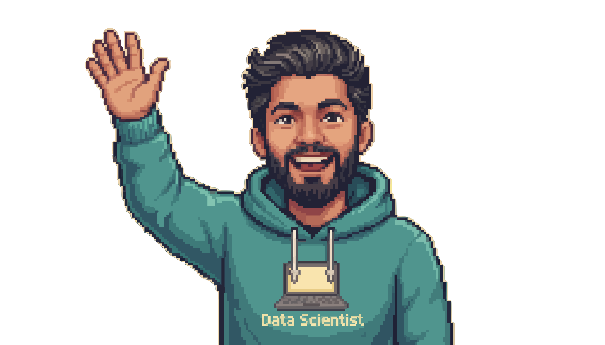

# Hi there!  I'm Muhammad Hamza

  

<!-- ═══════════════════════════════════════════════════════════ -->

  

 

<!-- ════════════════ CURRENTLY ═══════════════════════════════ -->

## ❯ cat currently.md

🔭 **AI/ML Engineer @ 1Click** — shipping a production multi-agent **AI voice caller** (ElevenLabs STT/TTS · Twilio · tool calling · Google Calendar booking)

🌱 **Exploring** LLMOps maturity — prompt versioning, RAGAS evals, LLM Gateways & GuardRails

💬 **Ask me about** GenAI pipelines, RAG, real-time voice AI, and multi-agent orchestration (LangChain/LangGraph)

📫 **Reach me:** hhamza2937@gmail.com

  

<!-- ═══════════════════ WHAT I DO ═══════════════════════════ -->

## ❯ whoami

  

  

<!-- ═══════════════════ PROFESSIONAL JOURNEY ═══════════════ -->

## ❯ git log --experience

<b>🎧 1Click</b> — <i>AI/ML Engineer</i> · Feb 2026 – Present

 

  

- **Architected & deployed a production multi-agent AI voice caller** — ElevenLabs STT/TTS with native Twilio integration, Google Calendar booking, and tool calling (slot lookup, booking, SMS dispatch). Built the **Python backend** (webhooks, websockets, DB), set up **CI/CD**, deployed, and ran successful **real-lead call tests**.
- Delivered an end-to-end **low-latency pipeline**: audio capture via loopback server (16 Hz in / 24 Hz out) → **Silero VAD** → LLM (**Groq + Ollama**) → **Kokoro TTS**, with a modular streaming architecture for real-time speech in/out.
- Engineered **GenAI content pipelines in Make.com** that extract & structure 1–2 hr audio/video via **AssemblyAI + Whisper** and generate AI content; tested on 50+ records, migrated to premium APIs, delivered a client guide video.
- Built an **automated activity-generation pipeline** with error handling, checkpoints, a tracker, and DB storage — produced **6,000+ activities** across schema iterations with a full QA report.
- **Orchestrated AI workflow automations** across **n8n, Zapier, Fillout**, integrating client platforms via APIs, webhooks & middleware (dynamic PDF generation, email nodes, JS data cleaning).
- **Optimized ML models** (Random Forest, XGBoost, CatBoost) with hyperparameter tuning, selecting **CatBoost** for the lowest error rate on app-rating prediction.

`Python` `ElevenLabs` `Twilio` `Silero VAD` `Groq` `Ollama` `Kokoro TTS` `AssemblyAI` `Whisper` `Make.com` `n8n` `Zapier` `CI/CD` `WebSockets` `CatBoost`

<b>🧬 AutonomousTech</b> — <i>Data & AI Engineer</i> · Oct 2025 – Mar 2026

 

 

- **Architected end-to-end ETL pipelines** ingesting & cleaning structured + unstructured data; **boosted ML model accuracy from 79% → 92%** via hybrid-data retraining, advanced EDA, and grouped outlier removal.
- Deployed a **Diabetes Detection System** (XGBoost) with a probability-based framework for interpretable Diabetic / Pre-diabetic / non-diabetic classification.
- Built **context-aware LLM prompt workflows** with **SerpAPI + Tavily** real-time web search and a **voice AI session retriever (Bland AI)** that maintained context across calls.
- Led **causal-inference research** (BSTS, CausalImpact, PyMC, GeoLift) isolating true campaign lift from organic growth to optimize budget allocation.

`ETL` `XGBoost` `EDA` `CausalImpact` `PyMC` `GeoLift` `Bland AI` `SerpAPI` `Tavily` `Python`

<b>🧪 Sofstica</b> — <i>AI/ML Engineer</i> · Mar 2025 – Oct 2025

 

 

- Engineered a **GenAI QA automation tool** with the **Groq API + LangChain**, cutting manual testing time by **40%** and raising coverage by **25%** via autonomous **Playwright** browser execution.
- Built a **RAG medical chatbot** with **LangChain agents** + a validation agent, benchmarking **DeepSeek R1 vs OpenAI Omni** responses.

`LangChain` `Groq` `Llama 3` `Playwright` `RAG` `DeepSeek R1` `OpenAI`

<b>🔬 Digitenic</b> — <i>Intern Data Scientist</i> · Jun 2024 – Aug 2024

 

- Developed a **Customer Churn Prediction** model with **TensorFlow + scikit-learn** achieving **85% validation accuracy**; drove preprocessing & feature engineering that reduced data noise feeding the model.

`TensorFlow` `scikit-learn` `Feature Engineering` `Python`

<b>🤖 ScaleAI</b> — <i>AI Trainer & Coder</i> · Feb 2023 – Jan 2024

 

- Labeled & reviewed code data to refine **Gemini** via **RLHF (Reinforcement Learning from Human Feedback)**; evaluated LLM responses and solved DSA/ML tasks under tight deadlines.

`RLHF` `LLM Evaluation` `Gemini` `DSA`

  

<!-- ═══════════════════ FEATURED PROJECTS ═══════════════════ -->

## ❯ ls projects/

<table>
<tr>
<td width="50%" valign="top">

### 🧠 **AI Codebase Document Generator**
**Personal Project — Autonomous Docgen**

- **Python + LangGraph + Groq (Llama 3)** tool that **autonomously traverses repositories** and generates structured Markdown docs
- **AST-based parser**, dependency-graph mapping, and **token-budget management**
- Docker-packaged for reproducible runs

`Python` `LangGraph` `Groq` `Llama 3` `AST` `Docker`

</td>
<td width="50%" valign="top">

### 💳 **IEEE-CIS Fraud Detection**
**Academic — Financial ML**

- **LightGBM** model on financial fraud data with **98% ROC-AUC**
- **Class-imbalance handling**, cross-validation & hyperparameter tuning

`Python` `LightGBM` `scikit-learn` `Pandas`

</td>
</tr>
<tr>
<td width="50%" valign="top">

### 🏥 **RAG Medical Chatbot**
**LangChain Agents + Validation**

- **Retrieval-Augmented Generation** medical chatbot with **LangChain agents**
- Built a **validation agent** benchmarking **DeepSeek R1 vs OpenAI Omni** responses

`LangChain` `RAG` `DeepSeek R1` `OpenAI` `Python`

</td>
<td width="50%" valign="top">

### 🔫 **Real-Time ATM Weapon Detection**
**Final Year Project — YOLOv8**

- Real-time **CCTV gun/knife detection** using **YOLOv8**
- Full-stack **React.js + Express.js + MongoDB** app with live video streaming & real-time alerts

`YOLOv8` `React.js` `Express.js` `MongoDB` `OpenCV`

</td>
</tr>
</table>

  

<!-- ═══════════════════ TECHNICAL ARSENAL ═══════════════════ -->

## ❯ neofetch

  

 

<b>📦 Full tech stack</b> — click to expand the complete arsenal

 

#### 🤖 GenAI & LLM

**Specialized**: LangChain • LangGraph • RAG • LLM Agents • Function/Tool Calling • Prompt Engineering • Llama 3 • LLM Fine-tuning • RLHF • LLM Gateways • GuardRails • RAGAS

#### 🎙️ Voice / Multimodal AI

**STT**: Deepgram • Whisper • AssemblyAI &nbsp;|&nbsp; **TTS**: ElevenLabs • Kokoro &nbsp;|&nbsp; **VAD**: Silero &nbsp;|&nbsp; **Telephony**: Twilio • Bland AI &nbsp;|&nbsp; Real-time audio packet handling

#### 📊 ML & Data Science

**Models**: XGBoost • CatBoost • Random Forest • Keras • YOLOv8 &nbsp;|&nbsp; **Causal Inference**: CausalImpact • PyMC • GeoLift • BSTS

#### ⚙️ Backend & Deployment

**REST APIs** • Webhooks • WebSockets • CRUD/Authorization endpoints • CI/CD • Deployment

#### 🔗 Workflow & Integration

**Make.com** • n8n • Zapier • Fillout • apitemplate.io • APIs & middleware • Multi-agent workflow orchestration

#### 🗄️ Data & Cloud / LLMOps

**DBs**: PostgreSQL • MySQL • MongoDB &nbsp;|&nbsp; **Cloud**: Digital Ocean • Vercel &nbsp;|&nbsp; **LLMOps**: MLflow • PostHog • Prompt Versioning

  

<!-- ═══════════════════ GITHUB ANALYTICS ═══════════════════ -->

## ❯ git stats

<!-- ═══════════════ 🔥 STREAK STATS ═══════════════════════ -->

  

 

  

  

<!-- ═══════════════ 🎮 CONTRIBUTION SHOWCASE ══════════════ -->

## ❯ git log --contributions

  <picture>
    <source media="(prefers-color-scheme: dark)" srcset="https://raw.githubusercontent.com/hamza-prof/hamza-prof/output/pacman-contribution-graph-dark.svg" />
    <source media="(prefers-color-scheme: light)" srcset="https://raw.githubusercontent.com/hamza-prof/hamza-prof/output/pacman-contribution-graph.svg" />
    
  </picture>

  

<!-- ═══════════════ EDUCATION & CERTIFICATIONS ═════════════ -->

## ❯ cat education.json

| 📜 | Detail | Period |
|---|---|---|
| 🎓 | **B.S. Computer Science** — IBA Sukkur University | 2021 – 2025 |
| 🧠 | **Full Stack Generative and Agentic AI** — Udemy | Nov 2025 – Jan 2026 |
| 📊 | **Data Science Bootcamp** — FAST NUCES | Jun 2023 – Sep 2023 |

  

<!-- ═══════════════ CONNECT ═════════════════════════════════ -->

## ❯ ./connect.sh

  
### 💼 Professional Network

### 💻 Coding Platforms

  

<!-- ═══════════════ PROFILE STATS ═══════════════════════════ -->

## ❯ top — profile stats

  
  
  
  

 

<!-- ═══════════════ FOOTER ══════════════════════════════════ -->

  

  ⭐️ From <a href="https://github.com/hamza-prof">hamza-prof</a> — Building production GenAI, voice & knowledge-retrieval platforms

